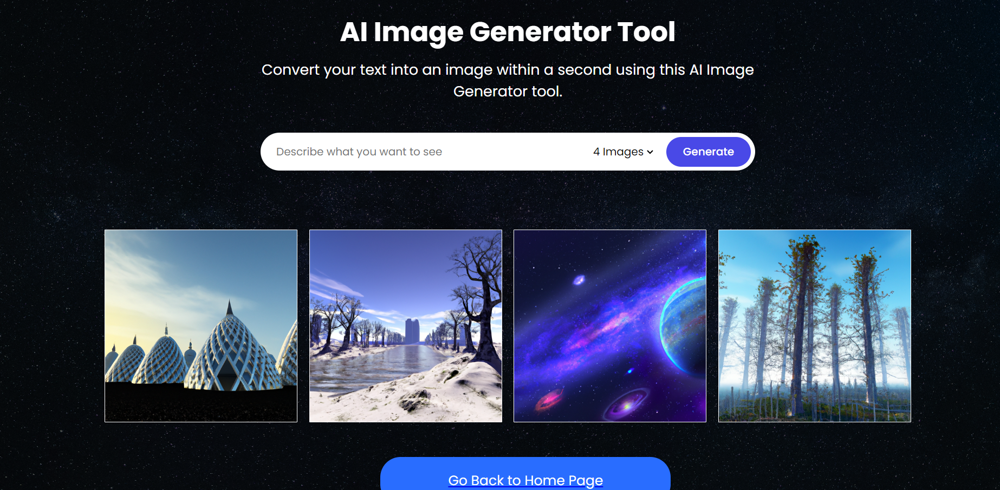
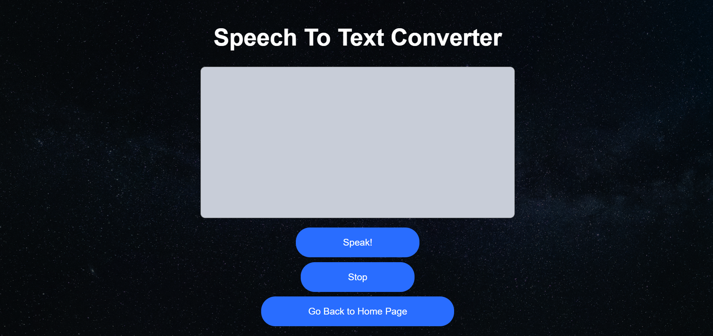
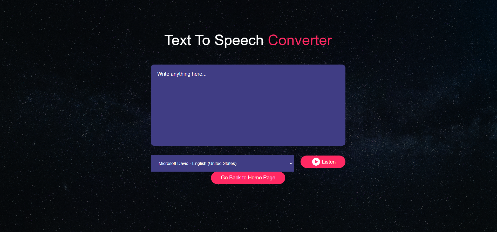

# Multimodal_AI_Toolkit

Welcome to the Multimodal Toolkit repository! This toolkit provides a set of three modalities for various text and speech processing tasks: Text-to-Image Generation, Speech-to-Text Recognition, and Text-to-Speech Generation. Whether you're working on natural language understanding, image generation, or speech processing projects, this toolkit can be a valuable asset.

## Modalities

### 1. Text-to-Image Generation
The Text-to-Image Generation modality allows you to generate images based on textual descriptions. It leverages advanced deep learning techniques to create visual representations from input text. 

### 2. Speech-to-Text Recognition
The Speech-to-Text Recognition modality enables you to transcribe spoken language into written text. It utilizes state-of-the-art speech recognition models to accurately convert audio input into textual output.

### 3. Text-to-Speech Generation
The Text-to-Speech Generation modality converts written text into spoken language. It employs sophisticated text-to-speech synthesis algorithms to produce natural-sounding speech from input text.

## Results

---
---
---

---
---
---

---
---
---

---

## Documentation
For detailed documentation on each modality and instructions on how to use them, please visit our website: [Multimodal AI Toolkit](https://orange-pond-05cc66c10.5.azurestaticapps.net/)

